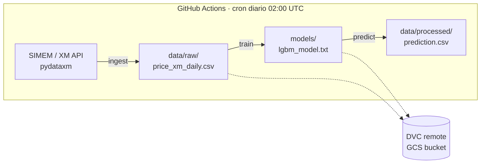

# ⚡ XM Energy MLOps

Pipeline de MLOps **end-to-end** para predecir el **precio de bolsa diario** del mercado eléctrico colombiano (XM/SIMEM), con un modelo LightGBM que estima el precio del día siguiente a partir de los últimos 7 días.

El proyecto es un MVP que demuestra las piezas centrales de un flujo MLOps: **versionado de datos** (DVC + GCS), **orquestación reproducible** (DVC pipelines), **automatización diaria** (GitHub Actions) y **autenticación segura sin llaves** (Workload Identity Federation).

---

## 🏗️ Arquitectura



El pipeline completo se define en [`dvc.yaml`](dvc.yaml) como un DAG de tres etapas que DVC ejecuta en orden y solo re-corre cuando cambian sus dependencias.

| Etapa | Script | Entrada | Salida |
|-------|--------|---------|--------|
| `ingest` | [`src/ingest_xm.py`](src/ingest_xm.py) | API SIMEM (dataset `EC6945`, variable `PB_Nal`) | `data/raw/price_xm_daily.csv` |
| `train` | [`src/train.py`](src/train.py) | CSV de precios diarios | `models/lgbm_model.txt` |
| `predict` | [`src/predict.py`](src/predict.py) | Modelo + CSV | `data/processed/prediction.csv` |

---

## 🧰 Stack

- **Python 3.11**
- **LightGBM** — modelo de regresión (gradient boosting)
- **pandas / numpy / scikit-learn** — procesamiento y métricas
- **DVC** (`dvc[gs]`) — versionado de datos y orquestación del pipeline
- **Google Cloud Storage** — remoto de DVC para datos y modelos
- **pydataxm** — cliente oficial para descargar datos de XM/SIMEM
- **Weights & Biases** — tracking de experimentos (actualmente en modo `offline`)
- **GitHub Actions** — CI/CD y ejecución programada
- **Workload Identity Federation** — autenticación a GCP sin llaves JSON

---

## 📁 Estructura del proyecto

```
xm-energy-mlops/
├── .github/workflows/
│   └── daily_pipeline.yml      # CI/CD: ejecuta el pipeline cada día
├── src/
│   ├── ingest_xm.py            # Descarga y agrega datos de XM a nivel diario
│   ├── features.py             # Lógica de features compartida (train + inferencia)
│   ├── train.py                # Entrena LightGBM y guarda el modelo
│   ├── predict.py              # Predice el precio del día siguiente
│   └── lineage.py              # Registra linaje (Git + DVC) en W&B
├── tests/                      # Suite de pytest
├── params.yaml                 # Hiperparámetros
├── data/
│   ├── raw/                    # Datos crudos (versionados con DVC, no en git)
│   └── processed/              # Predicciones
├── models/                     # Modelo entrenado (versionado con DVC, no en git)
├── dvc.yaml                    # Definición del pipeline (DAG)
├── dvc.lock                    # Estado reproducible del pipeline
└── requirements.txt
```

---

## 🚀 Puesta en marcha (local)

### Requisitos previos
- Python 3.11
- Una cuenta de Google Cloud con acceso al bucket de DVC (para `dvc pull`/`push`)

### Instalación

```bash
git clone https://github.com/carlos-osorio/xm-energy-mlops.git
cd xm-energy-mlops
python -m venv venv
source venv/bin/activate        # En Windows: venv\Scripts\activate
pip install -r requirements.txt
```

### Ejecutar el pipeline completo

```bash
dvc repro
```

Esto corre `ingest → train → predict` en orden. Para traer los datos/modelos versionados desde GCS antes de correr:

```bash
dvc pull
```

### Ejecutar una etapa individual

```bash
python -m src.train      # Solo entrenar
python -m src.predict    # Solo predecir (requiere un modelo entrenado)
```

### Tests

```bash
pip install -r requirements-dev.txt
pytest -v
```

Los tests cubren la lógica de features (incluido un test que **blinda el alineamiento
train/serve**), la extracción de linaje y la estructura de `params.yaml`. En CI se
ejecutan antes del pipeline: si fallan, no se entrena nada.

---

## 🤖 Automatización (CI/CD)

El workflow [`daily_pipeline.yml`](.github/workflows/daily_pipeline.yml) se ejecuta:

- **Automáticamente:** todos los días a las **02:00 UTC** (`cron`).
- **Manualmente:** desde la pestaña *Actions → Daily MLOps Pipeline → Run workflow*.

En cada corrida: autentica a GCP (Workload Identity), instala dependencias, ejecuta `dvc repro`, sube datos/modelos al remoto (`dvc push`) y commitea la metadata de DVC actualizada.

---

## 🧠 Modelo

- **Tipo:** LightGBM (regresión).
- **Features:** los precios de los últimos 7 días, incluyendo el día actual (`lag_1` = hoy … `lag_7` = hace 6 días).
- **Objetivo:** precio promedio de bolsa del día siguiente.
- **Validación:** split cronológico — los últimos 30 días se reservan para validación (sin barajar, para evitar fuga temporal).
- **Métrica:** RMSE en $/MWh.

---

## 🗺️ Roadmap

Mejoras planeadas para madurar el proyecto:

- [ ] Separar **entrenamiento** y **despliegue** en dos workflows independientes.
- [ ] Activar W&B **online** como registro de experimentos y modelos.
- [ ] **Gate de promoción a producción**: solo desplegar el modelo nuevo si mejora el RMSE del actual.
- [ ] Centralizar hiperparámetros en `params.yaml` (soporte nativo de DVC).
- [ ] Enriquecer features: calendario (día de semana, festivos) y variables hidrológicas (aportes, embalses) — el precio de bolsa colombiano es fuertemente hidrológico.
- [ ] Baseline ingenuo ("mañana = hoy") para contextualizar el RMSE.
- [x] Fijar versiones en `requirements.txt` y semilla aleatoria para reproducibilidad.
- [x] Tests con `pytest` (features, linaje, params).
- [ ] Validación de datos en `ingest` (rangos, nulos, continuidad de fechas).

---

## ⚠️ Estado

Proyecto en desarrollo activo, con fines educativos y de portafolio. **No** constituye asesoría financiera ni debe usarse para decisiones de trading real.
