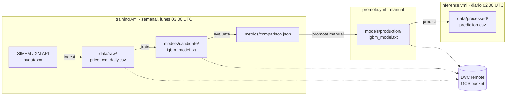

# ⚡ XM Energy MLOps

Pipeline de MLOps **end-to-end** para predecir el **precio de bolsa diario** del mercado eléctrico colombiano (XM/SIMEM), con un modelo LightGBM que estima el precio del día siguiente a partir de los últimos 7 días.

El proyecto es un MVP que demuestra las piezas centrales de un flujo MLOps: **versionado de datos y modelos** (DVC + GCS), **orquestación reproducible** (DVC pipelines), **automatización con workflows separados** (GitHub Actions) y **autenticación segura sin llaves** (Workload Identity Federation).

---

## 🏗️ Arquitectura

El proyecto separa **entrenamiento** y **despliegue** en tres workflows independientes de GitHub Actions, con un registro de modelos de dos niveles (`candidate` / `production`) versionado en DVC/GCS:



El pipeline de datos y entrenamiento se define en [`dvc.yaml`](dvc.yaml) como un DAG que DVC ejecuta en orden y solo re-corre cuando cambian sus dependencias.

| Etapa | Script | Entrada | Salida |
|-------|--------|---------|--------|
| `ingest` | [`src/ingest_xm.py`](src/ingest_xm.py) | API SIMEM (dataset `EC6945`, variable `PB_Nal`) | `data/raw/price_xm_daily.csv` |
| `train` | [`src/train.py`](src/train.py) | CSV de precios diarios | `models/candidate/lgbm_model.txt`, `metrics/candidate.json` |
| `evaluate` | [`src/evaluate.py`](src/evaluate.py) | Candidato vs. producción | `metrics/comparison.json` (recomendación PROMOTE/KEEP) |
| `promote` | [`src/promote.py`](src/promote.py) | Candidato aprobado | `models/production/lgbm_model.txt`, `metrics/production.json` |
| `predict` | [`src/predict.py`](src/predict.py) | Modelo de producción + CSV | `data/processed/prediction.csv` |

---

## 🧰 Stack

- **Python 3.11**
- **LightGBM** — modelo de regresión (gradient boosting)
- **pandas / numpy / scikit-learn** — procesamiento y métricas
- **DVC** (`dvc[gs]`) — versionado de datos y orquestación del pipeline
- **Google Cloud Storage** — remoto de DVC para datos y modelos
- **pydataxm** — cliente oficial para descargar datos de XM/SIMEM
- **GitHub Actions** — CI/CD y ejecución programada
- **Workload Identity Federation** — autenticación a GCP sin llaves JSON

---

## 📁 Estructura del proyecto

```
xm-energy-mlops/
├── .github/workflows/
│   ├── training.yml             # Entrena candidato y lo evalúa (semanal)
│   ├── promote.yml              # Promueve candidato → producción (manual)
│   └── inference.yml            # Predice con el modelo de producción (diario)
├── src/
│   ├── ingest_xm.py             # Descarga y agrega datos de XM a nivel diario
│   ├── features.py              # Lógica de features compartida (train + inferencia)
│   ├── train.py                 # Entrena LightGBM y guarda el candidato
│   ├── evaluate.py              # Compara candidato vs. producción (gate de promoción)
│   ├── promote.py               # Promueve el candidato aprobado a producción
│   ├── registry.py              # Utilidades del registro de modelos candidate/production
│   ├── predict.py               # Predice el precio del día siguiente con el modelo de producción
│   └── lineage.py               # Registra linaje (Git + DVC)
├── tests/                       # Suite de pytest
├── params.yaml                  # Hiperparámetros y umbral de promoción
├── data/
│   ├── raw/                     # Datos crudos (versionados con DVC, no en git)
│   └── processed/                # Predicciones
├── models/
│   ├── candidate/                # Modelo recién entrenado (versionado con DVC, no en git)
│   └── production/               # Modelo desplegado (versionado con DVC, no en git)
├── metrics/
│   ├── candidate.json           # Métricas del candidato (en git)
│   ├── production.json          # Métricas del modelo en producción (en git)
│   └── comparison.json          # Resultado del gate: PROMOTE/KEEP (en git)
├── dvc.yaml                     # Definición del pipeline (DAG)
├── dvc.lock                     # Estado reproducible del pipeline
└── requirements.txt
```

---

## 🚀 Puesta en marcha (local)

### Requisitos previos
- Python 3.11
- Una cuenta de Google Cloud con acceso al bucket de DVC (para `dvc pull`/`push`)

### Instalación

```bash
git clone https://github.com/carlos-osorio/xm-energy-mlops.git
cd xm-energy-mlops
python -m venv venv
source venv/bin/activate        # En Windows: venv\Scripts\activate
pip install -r requirements.txt
```

### Ejecutar el pipeline completo

```bash
dvc repro
```

Esto corre `ingest → train` en orden y produce el candidato en `models/candidate/`. `predict` se ejecuta aparte, sobre el modelo de `models/production/` (ver [Ciclo de vida del modelo](#-ciclo-de-vida-del-modelo)). Para traer los datos/modelos versionados desde GCS antes de correr:

```bash
dvc pull
```

### Ejecutar una etapa individual

```bash
python -m src.train      # Solo entrenar
python -m src.predict    # Solo predecir (requiere un modelo entrenado)
```

### Tests

```bash
pip install -r requirements-dev.txt
pytest -v
```

Los tests cubren la lógica de features (incluido un test que **blinda el alineamiento
train/serve**), la extracción de linaje y la estructura de `params.yaml`. En CI se
ejecutan antes del pipeline: si fallan, no se entrena nada.

---

## 🤖 Automatización (CI/CD)

Tres workflows independientes, cada uno autentica a GCP vía Workload Identity Federation:

- **[`training.yml`](.github/workflows/training.yml)** — **Semanal** (`cron` lunes 03:00 UTC) o manual (*Actions → Training Pipeline → Run workflow*). Corre tests, ejecuta `dvc repro` (ingest + train) para producir el candidato en `models/candidate/`, lo evalúa contra producción con `python -m src.evaluate` (genera `metrics/comparison.json` como artifact de la corrida), sube todo a GCS (`dvc push`) y commitea la metadata.
- **[`promote.yml`](.github/workflows/promote.yml)** — **Solo manual** (*Actions → Promote Model → Run workflow*). Trae el candidato desde GCS, corre `python -m src.promote` para copiarlo a `models/production/` (si el gate lo recomienda), versiona el modelo de producción con DVC, sube a GCS y commitea `metrics/production.json`.
- **[`inference.yml`](.github/workflows/inference.yml)** — **Diario** (`cron` 02:00 UTC) o manual (*Actions → Inference Pipeline → Run workflow*). Corre tests, trae el modelo de producción desde GCS, ingesta datos frescos (`dvc repro ingest`), predice con `python -m src.predict`, sube datos a GCS y commitea la metadata.

---

## 🔄 Ciclo de vida del modelo

El registro de modelos tiene dos niveles — `candidate` (recién entrenado) y `production` (desplegado) — y la promoción de uno a otro es siempre una decisión explícita, nunca automática:

1. **Entrenamiento:** `training.yml` corre semanalmente (o manualmente), entrena un candidato nuevo y lo evalúa contra el modelo de producción actual usando el margen definido en `params.yaml` (`promotion.margin`, 1% de mejora relativa de RMSE).
2. **Revisión:** el resultado del gate queda en `metrics/comparison.json` (también publicado como artifact de la corrida), con una recomendación `PROMOTE` o `KEEP`.
3. **Promoción:** si la recomendación es `PROMOTE`, alguien dispara manualmente `promote.yml`, que copia el candidato a `models/production/` y actualiza `metrics/production.json`.
4. **Bootstrap:** en un repo nuevo no existe todavía modelo de producción. La primera corrida de `training.yml` genera el primer candidato (el gate lo recomienda por defecto al no haber baseline); tras promoverlo manualmente con `promote.yml`, `inference.yml` puede empezar a correr con normalidad — el cron diario simplemente fallará (sin modelo de producción que cargar) hasta que exista al menos una promoción.

---

## 🧠 Modelo

- **Tipo:** LightGBM (regresión).
- **Features:** los precios de los últimos 7 días, incluyendo el día actual (`lag_1` = hoy … `lag_7` = hace 6 días).
- **Objetivo:** precio promedio de bolsa del día siguiente.
- **Validación:** split cronológico — los últimos 30 días se reservan para validación (sin barajar, para evitar fuga temporal).
- **Métrica:** RMSE en $/MWh.

---

## 🗺️ Roadmap

Mejoras planeadas para madurar el proyecto:

- [x] Separar **entrenamiento** y **despliegue** en dos workflows independientes.
- [x] **Gate de promoción a producción**: solo desplegar el modelo nuevo si mejora el RMSE del actual.
- [ ] Centralizar hiperparámetros en `params.yaml` (soporte nativo de DVC).
- [ ] Enriquecer features: calendario (día de semana, festivos) y variables hidrológicas (aportes, embalses) — el precio de bolsa colombiano es fuertemente hidrológico.
- [ ] Baseline ingenuo ("mañana = hoy") para contextualizar el RMSE.
- [x] Fijar versiones en `requirements.txt` y semilla aleatoria para reproducibilidad.
- [x] Tests con `pytest` (features, linaje, params).
- [ ] Validación de datos en `ingest` (rangos, nulos, continuidad de fechas).

---

## ⚠️ Estado

Proyecto en desarrollo activo, con fines educativos y de portafolio. **No** constituye asesoría financiera ni debe usarse para decisiones de trading real.
